# 스프링 DB 1편 - 데이터 접근 핵심 원리

## 1. JDBC 이해

### JDBC 이해

#### JDBC 등장 이유
애플리케이션을 개발할 때 중요한 데이터는 대부분 데이터베이스에 보관한다.

클라이언트가 애플리케이션 서버를 통해 데이터를 저장하거나 조회하면, 애플리케이션 서버는 다음 과정을 통해서 데이터베이스를 사용한다.

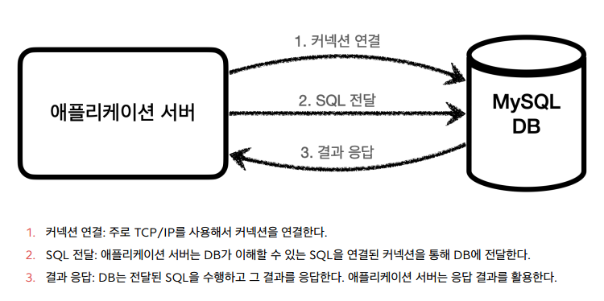

DB를 변경하고자 할 때, 문제는 각각의 데이터베이스마다 커넥션을 연결하는 방법, SQL을 전달하는 방법, 그리고 결과를 응답 받는 방법이 모두 다르다는 점이다.

여기에는 2가지 큰 문제가 있다.
1. 데이터베이스를 다른 종류의 데이터베이스로 변경하면 애플리케이션 서버에 개발된 데이터베이스 사용 코드도 함께 변경해야 한다.
2. 개발자가 각각의 데이터베이스마다 커넥션 연결, SQL 전달, 그리고 그 결과를 응답 받는 방법을 새로 학습해야 한다.

이런 문제를 해결하기 위해 JDBC라는 자바 표준이 등장한다.

### JDBC 표준 인터페이스
JDBC(Java Database Connectivity)는 자바에서 데이터베이스에 접속할 수 있도록 하는 자바 API다.
JDBC는 데이터베이스에서 자료를 쿼리하거나 업데이트하는 방법을 제공한다. - 위키백과

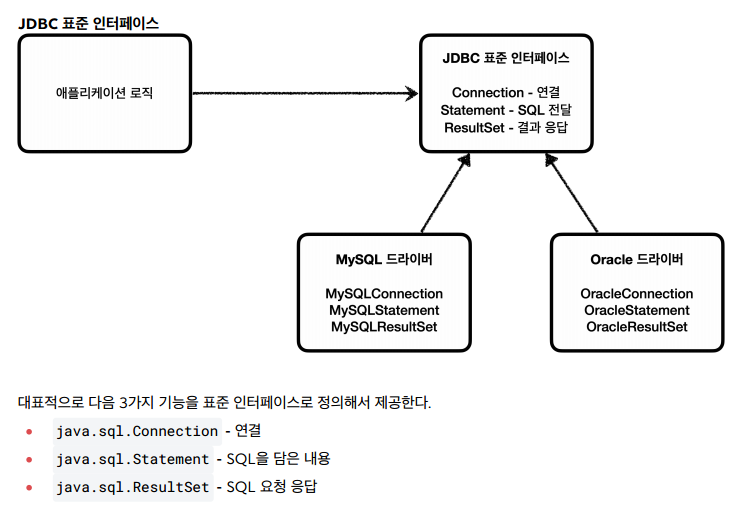

JDBC의 등장으로 다음 2가지 문제가 해결되었다.
1. 애플리케이션 로직은 이제 JDBC 표준 인터페이스에만 의존한다.
2. 개발자는 JDBC 표준 인터페이스 사용법만 학습하면 된다.

#### 표준화의 한계
JDBC의 등장으로 많은 것이 편리해졌지만, 각각의 데이터베이스마다 SQL, 데이터타입 등의 일부 사용법 다르다.
ANSI SQL이라는 표준이 있기는 하지만 일반적인 부분만 공통화했기 때문에 한계가 있다. 대표적으로 실무에서 기본으로 사용하는 페이징 SQL은 각각의 데이터베이스마다 사용법이 다르다.

### JDBC와 최신 데이터 접근 기술
JDBC는 1997년에 출시될 정도로 오래된 기술이고, 사용하는 방법도 복잡하다.
그래서 최근에는 JDBC를 직접 사용하기 보다는 JDBC를 편리하게 사용하는 다양한 기술이 존재한다.
대표적으로 SQL Mapper와 ORM 기술로 나눌 수 있다.

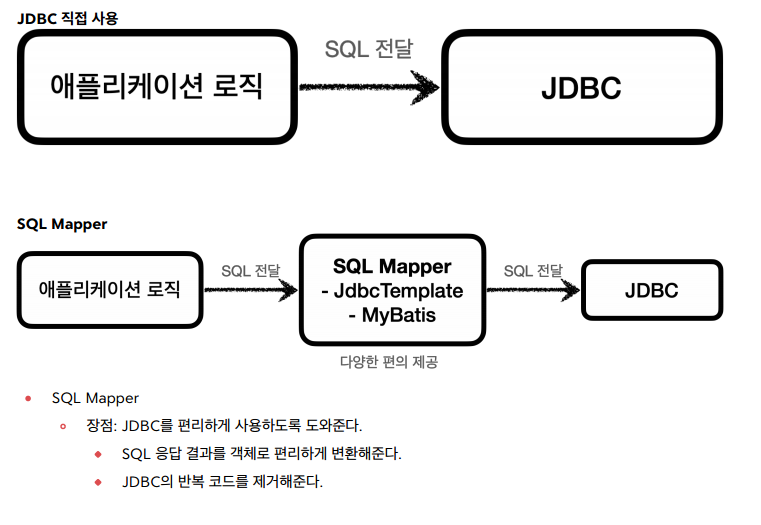
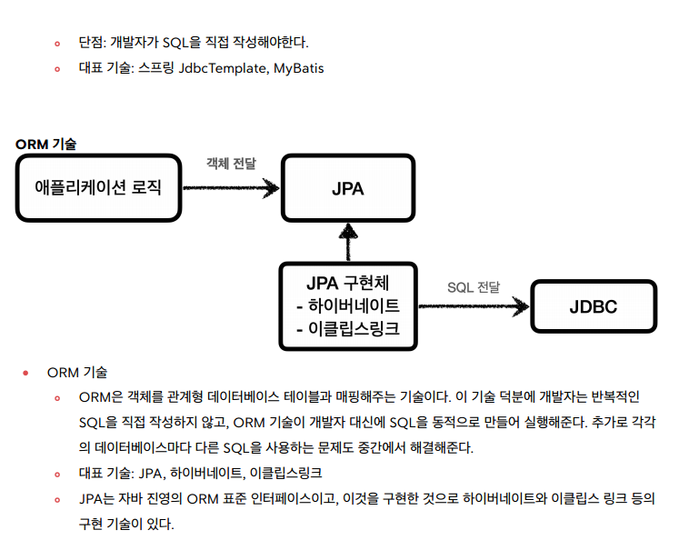

#### SQL Mapper vs ORM 기술
SQL Mapper는 SQL만 직접 작성하면 나머지 번거로운 일은 SQL Mapper가 대신 해결해준다.
SQL Mapper는 SQL만 작성할 줄 알면 금방 배워서 사용할 수 있다.

ORM기술은 SQL 자체를 작성하지 않아도 되어서 개발 생산성이 매우 높아진다. 
편리한 반면에 쉬운 기술은 아니므로 실무에서 사용하려면 깊이있게 학습해야 한다.

이런 기술들도 내부에서는 모두 JDBC를 사용한다. 따라서 JDBC를 직접 사용하지는 않더라도, JDBC가 어떻게 동작하는지 기본 원리를 알아두어야 한다.

### 데이터베이스 연결(H2 데이터베이스 사용)
애플리케이션과 데이터베이스를 연결해보자

#### ConnectionConst
```java
public abstract class ConnectionConst {
    public static final String URL = "jdbc:h2:tcp://localhost/~/test";
    public static final String USERNAME = "sa";
    public static final String PASSWORD = "";
}
```

#### DBConnectionUtil
```java
@Slf4jpublic class DBConnectionUtil {
    public static Connection getConnection() {
        try {
            Connection connection = DriverManager.getConnection(URL, USERNAME,
                    PASSWORD);
            log.info("get connection={}, class={}", connection,
                    connection.getClass());
            return connection;
        } catch (SQLException e) {
            throw new IllegalStateException(e);
        }
    }
}
```

데이터베이스에 연결하려면 JDBC가 제공하는 `DriverManager.getConnection(..)`를 사용하면 된다.
이렇게 하면 라이브러리에 있는 데이터베이스 드라이버를 찾아서 해당 드라이버가 제공하는 커넥션을 반환해준다.

#### JDBC 커넥션 인터페이스와 구현
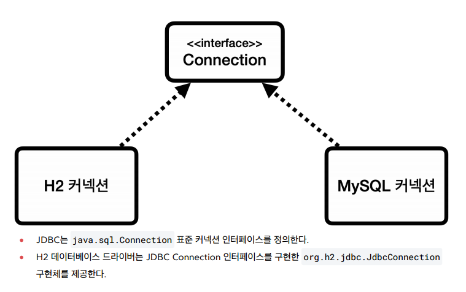

#### DriverManager 커넥션 요청 흐름
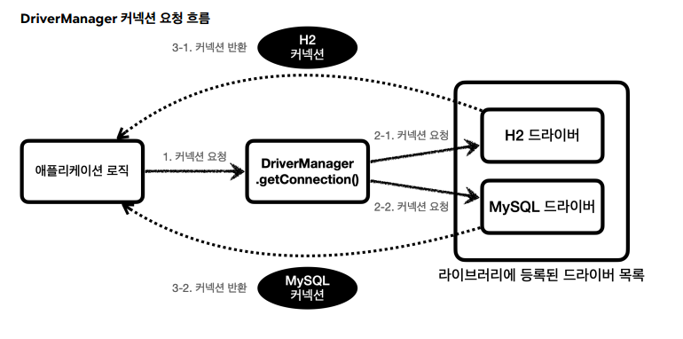

1. 애플리케이션 로직에서 커넥션이 필요하면 `DriverManager.getConnection()`을 호출한다.
2. `DriverManager` 는 라이브러리에 등록된 드라이버 목록을 자동으로 인식한다. 이 드라이버들에게 순서대로 다음 정보를 넘겨서 커넥션을 획득할 수 있는지 확인한다.
3. 이렇게 찾은 커넥션 구현체가 클라이언트에 반환된다.

### JDBC 개발 - 등록

#### 회원 등록 예시 코드
```java
/**
 * JDBC - DriverManager 사용
 */
@Slf4jpublic class MemberRepositoryV0 {
    public Member save(Member member) throws SQLException {
        String sql = "insert into member(member_id, money) values(?, ?)";
        Connection con = null;
        PreparedStatement pstmt = null;
        try {
            con = getConnection();
            pstmt = con.prepareStatement(sql);
            pstmt.setString(1, member.getMemberId());
            pstmt.setInt(2, member.getMoney());
            pstmt.executeUpdate();
            return member;
        } catch (SQLException e) {
            log.error("db error", e);
            throw e;
        } finally {
            close(con, pstmt, null);
        }
    }

    private void close(Connection con, Statement stmt, ResultSet rs) {
        if (rs != null) {
            try {
                rs.close();
            } catch (SQLException e) {
                log.info("error", e);
            }
        }
        if (stmt != null) {
            try {
                stmt.close();
            } catch (SQLException e) {
                log.info("error", e);
            }
        }
        if (con != null) {
            try {
                con.close();
            } catch (SQLException e) {
                log.info("error", e);
            }
        }
    }

    private Connection getConnection() {
        return DBConnectionUtil.getConnection();
    }
}
```

#### 리소스 정리
쿼리를 실행하고 나면 리소스를 정리해야 한다. 여기서는 `Connection`, `PreparedStatement`를 사용했다.
리소스를 정리할 때는 항상 역순으로 해야한다.

리소스 정리는 꼭! 해주어야 한다. 따라서 예외가 발생하든, 하지 않든 항상 수행되어야 하므로 `finally`구문에 주의해서 작성해야 한다.
이 부분을 놓치게 되면 리소스 누수가 발생하고 결과적으로 커넥션 부족으로 장애가 발생할 수 있다.

### JDBC 개발 - 조회

#### 회원 조회 사용 예시
```java
public Member findById(String memberId) throws SQLException {
    String sql = "select * from member where member_id = ?";
    Connection con = null;
    PreparedStatement pstmt = null;
    ResultSet rs = null;
    try {
        con = getConnection();
        pstmt = con.prepareStatement(sql);
        pstmt.setString(1, memberId);
        rs = pstmt.executeQuery();
        if (rs.next()) {
            Member member = new Member();
            member.setMemberId(rs.getString("member_id"));
            member.setMoney(rs.getInt("money"));
            return member;
        } else {
            throw new NoSuchElementException("member not found memberId=" +
                    memberId);
        }
    } catch (SQLException e) {
        log.error("db error", e);
        throw e;
    } finally {
        close(con, pstmt, rs);
    }
}
```

#### ResultSet
- 보통 select 쿼리의 결과가 순서대로 들어간다.
- `ResultSet` 내부에 있는 커서(`cursor`)를 이동해서 다음 데이터를 조회할 수 있다.
- `rs.next()` : 이것을 호출하면 커서가 다음으로 이동한다. 참고로 최초의 커서는 데이터를 가리키고 있지 않기 때문에 rs.next() 를 최초 한번은 호출해야 데이터를 조회할 수 있다

#### ResultSet 결과 예시
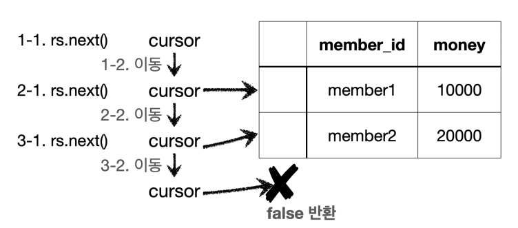

## 2. 커넥션풀과 데이터소스 이해

### 커넥션 풀 이해

#### 데이터베이스 커넥션을 매번 획득
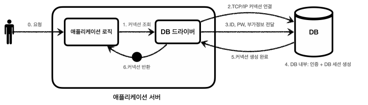

데이터베이스 커넥션을 획득할 때는 다음과 같은 복잡한 과정을 거친다.
1. 애플리케이션 로직은 DB 드라이버를 통해 커넥션을 조회한다.
2. DB 드라이버는 DB와 TCP/IP 커넥션을 연결한다. 물론 이 과정에서 3 way handshake 같은 TCP/IP 연결을 위한 네트워크 동작이 발생한다.
3. DB 드라이버는 TCP/IP 커넥션이 연결되면 ID, PW와 기타 부가정보를 DB에 전달한다.
4. DB는 ID, PW를 통해 내부 인증을 완료하고, 내부에 DB 세션을 생성한다.
5. DB는 커넥션 생성이 완료되었다는 응답을 보낸다.
6. DB 드라이버는 커넥션 객체를 생성해서 클라이언트에 반환한다.

이렇게 커넥션을 새로 만드는 것은 과정도 복잡하고 시간도 많이 소모되는 일이다.
DB는 물론이고 애플리케이션 서버에서도 리소스를 매번 사용해야 한다.

이런 문제를 한번에 해결하는 아이디어가 바로 커넥션을 미리 생성해두고 사용하는 커넥션 풀이라는 방법이다.
커넥션 풀은 이름 그대로 커넥션을 관리하는 풀이다.

애플리케이션을 시작하는 시점에 커넥션 풀은 필요한 만큼 커넥션을 미리 확보해서 풀에 보관한다.
서비스의 특징과 서버 스펙에 따라 다르지만 기본값은 보통 10개이다.
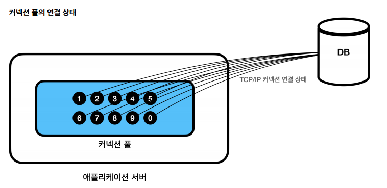

- 커넥션 풀은 서버당 최대 커넥션 수를 제한할 수 있다. 따라서 DB에 무한정 연결이 생성되는 것을 막아주어서 DB를 보호하는 효과도 있다.
- 이런 커넥션 풀은 얻는 이점이 매우 크기 때문에 실무에서는 항상 기본으로 사용한다.
- 커넥션 풀은 개념적으로 단순해서 직접 구현할 수도 있지만, 사용도 편리하고 성능도 뛰어난 오픈소스 커넥션 풀이 많기 때문에 오픈소스를 사용하는 것이 좋다.
- 성능과 사용의 편리함 측면에서 최근에는 hikariCP 를 주로 사용한다. 

### DataSource 이해

#### 커넥션을 획득하는 다양한 방법
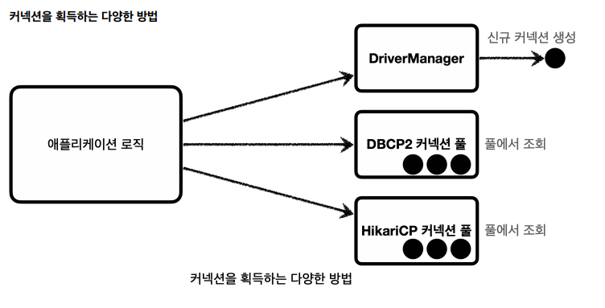

#### DriverManager를 통해 커넥션 획득하다가 커넥션 풀로 변경시 문제
애플리케이션 로직에서 DriverManager 를 사용해서 커넥션을 획득하다가 HikariCP 같은 커넥션 풀을 사용하도록 변경하면 커넥션을 획득하는 애플리케이션 코드도 함께 변경해야 한다. 
의존관계가 DriverManager 에서 HikariCP 로 변경되기 때문이다. 
물론 둘의 사용법도 조금씩 다를 것이다.

#### 커넥션을 획득하는 방법을 추상화
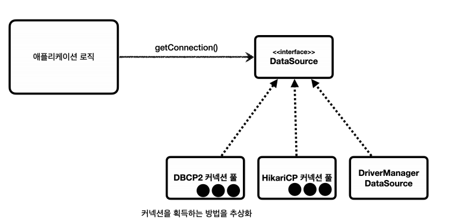

* 자바에서는 이런 문제를 해결하기 위해 `javax.sql.DataSource` 라는 인터페이스를 제공한다.
* `DataSource`는 커넥션을 획득하는 방법을 추상화 하는 인터페이스이다.
* 이 인터페이스의 핵심 기능은 커넥션 조회 하나이다. (다른 일부 기능도 있지만 크게 중요하지 않다.)

#### DataSource 인터페이스
```java
public interface DataSource {
    Connection getConnection() throws SQLException;
}
```

대부분의 커넥션 풀은 DataSource 인터페이스를 이미 구현해두었다. 
따라서 개발자는 DBCP2 커넥션 풀, HikariCP 커넥션 풀 의 코드를 직접 의존하는 것이 아니라 DataSource 인터페이스에만 의존하도록 애플리케이션 로직을 작성하면 된다.

`DriverManager`는 `DataSource` 인터페이스를 사용하지 않는다. 
따라서 `DriverManager` 는 직접 사용해야 한다. 
따라서 `DriverManager` 를 사용하다가 `DataSource`기반의 커넥션 풀을 사용하도록 변경하면 관련 코드를 다 고쳐야 한다. 
이런 문제를 해결하기 위해 스프링은 `DriverManager` 도 `DataSource` 를 통해서 사용할 수 있도록 `DriverManagerDataSource` 라는 `DataSource` 를 구현한 클래스를 제공한다.

### DataSource 예제1 - DriverManager

#### 사용 예시
```java
@Test
 void dataSourceDriverManager() throws SQLException {
    //DriverManagerDataSource - 항상 새로운 커넥션 획득
    DriverManagerDataSource dataSource = new DriverManagerDataSource(URL,
            USERNAME, PASSWORD);
    useDataSource(dataSource);
}
private void useDataSource(DataSource dataSource) throws SQLException {
    Connection con1 = dataSource.getConnection();
    Connection con2 = dataSource.getConnection();
    log.info("connection={}, class={}", con1, con1.getClass());
    log.info("connection={}, class={}", con2, con2.getClass());
}
```

`DriverManager` 는 커넥션을 획득할 때 마다 `URL` , `USERNAME` , `PASSWORD` 같은 파라미터를 계속 전달해야 한다. 
반면에 `DataSource` 를 사용하는 방식은 처음 객체를 생성할 때만 필요한 파리미터를 넘겨두고, 커넥션을 획득할 때는 단순히 `dataSource.getConnection()` 만 호출하면 된다.

### DataSource 예제2 - 커넥션 풀

#### 데이터소스 커넥션 풀 사용 예시
```java
@Test
void dataSourceConnectionPool() throws SQLException, InterruptedException {
    //커넥션 풀링: HikariProxyConnection(Proxy) -> JdbcConnection(Target)
    HikariDataSource dataSource = new HikariDataSource();
    dataSource.setJdbcUrl(URL);
    dataSource.setUsername(USERNAME);
    dataSource.setPassword(PASSWORD);
    dataSource.setMaximumPoolSize(10);
    dataSource.setPoolName("MyPool");
    useDataSource(dataSource);
    Thread.sleep(1000); //커넥션 풀에서 커넥션 생성 시간 대기 로그 확인 용
}
```

## 3. 트랜잭션 이해

### 트랜잭션 - 개념 이해
데이터를 저장할 때 단순히 파일에 저장해도 되는데, 데이터베이스에 저장하는 이유는 무엇일까?

여러가지 이유가 있지만, 가장 대표적인 이유는 바로 데이터베이스는 트랜잭션이라는 개념을 지원하기 때문이다.

트랜잭션을 이름 그대로 번역하면 거래라는 뜻이다. 이것을 쉽게 풀어서 이야기하면, 데이터베이스에서 트랜잭션은 하
나의 거래를 안전하게 처리하도록 보장해주는 것을 뜻한다.

모든 작업이 성공해서 데이터베이스에 정상 반영하는 것을 커밋( Commit )이라 하고, 작업 중 하나라도 실패해서 거래
이전으로 되돌리는 것을 롤백( Rollback )이라 한다.

#### 트랜잭션 ACID
* **원자성**: 트랜잭션 내에서 실행한 작업들은 마치 하나의 작업인 것처럼 모두 성공 하거나 모두 실패해야 한다.
* **일관성**: 모든 트랜잭션은 일관성 있는 데이터베이스 상태를 유지해야 한다. 예를 들어 데이터베이스에서 정한 무결성 제약 조건을 항상 만족해야 한다.
* **격리성**: 동시에 실행되는 트랜잭션들이 서로에게 영향을 미치지 않도록 격리한다. 예를 들어 동시에 같은 데이터를 수정하지 못하도록 해야 한다. 격리성은 동시성과 관련된 성능 이슈로 인해 트랜잭션 격리 수준(Isolation level)을 선택할 수 있다.
* **지속성**: 트랜잭션을 성공적으로 끝내면 그 결과가 항상 기록되어야 한다. 중간에 시스템에 문제가 발생해도 데이터베이스 로그 등을 사용해서 성공한 트랜잭션 내용을 복구해야 한다.

#### 트랜잭션 격리 수준 - Isolation level
* READ UNCOMMITED(커밋되지 않은 읽기)
* READ COMMITTED(커밋된 읽기) - 일반적으로 많이 사용
* REPEATABLE READ(반복 가능한 읽기)
* SERIALIZABLE(직렬화 가능)

### 데이터베이스 연결 구조와 DB 세션

#### 데이터베이스 연결 구조
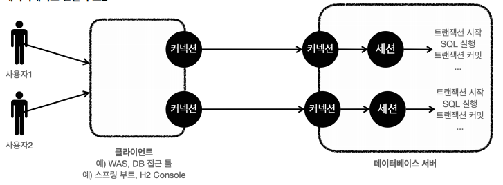

* 개발자가 클라이언트를 통해 SQL을 전달하면 현재 커넥션에 연결된 세션이 SQL을 실행한다.
* 세션은 트랜잭션을 시작하고, 커밋 또는 롤백을 통해 트랜잭션을 종료한다. 그리고 이후에 새로운 트랜잭션을 다시 시작할 수 있다.
* 사용자가 커넥션을 닫거나, 또는 DBA(DB 관리자)가 세션을 강제로 종료하면 세션은 종료된다.

### DB 락 - 개념 이해
세션1이 트랜잭션을 시작하고 데이터를 수정하는 동안 아직 커밋을 수행하지 않았는데, 세션2에서 동시에 같은 데이터를 수정하게 되면 여러가지 문제가 발생한다. 
바로 트랜잭션의 원자성이 깨지는 것이다.

이런 문제를 방지하려면, 세션이 트랜잭션을 시작하고 데이터를 수정하는 동안에는 커밋이나 롤백 전까지 다른 세션에서 해당 데이터를 수정할 수 없게 막아야 한다.

### DB 락 - 조회

#### 일반적인 조회는 락을 사용하지 않는다.
데이터베이스마다 다르지만, 보통 데이터를 조회할 때는 락을 획득하지 않고 바로 데이터를 조회할 수 있다

#### 조회와 락
데이터를 조회할 때도 락을 획득하고 싶을 때가 있다. 이럴 때는 `select for update` 구문을 사용하면 된다.

### 트랜잭션 - 적용
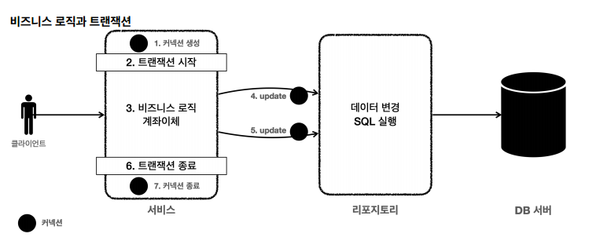

- 트랜잭션은 비즈니스 로직이 있는 서비스 계층에서 시작해야 한다. 비즈니스 로직이 잘못되면 해당 비즈니스 로직으로 인해 문제가 되는 부분을 함께 롤백해야 하기 때문이다.
- 애플리케이션에서 DB 트랜잭션을 사용하려면 트랜잭션을 사용하는 동안 같은 커넥션을 유지해야한다. 그래야 같
  은 세션을 사용할 수 있다.

